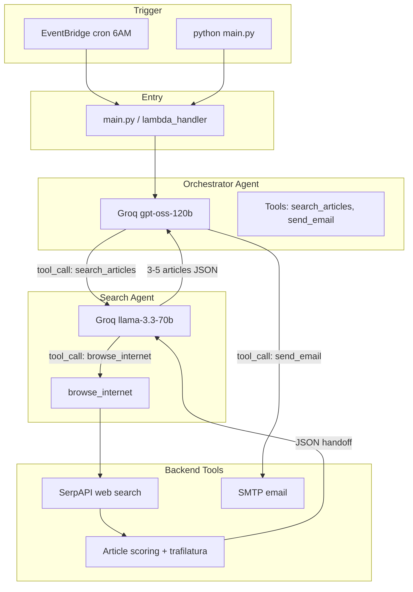
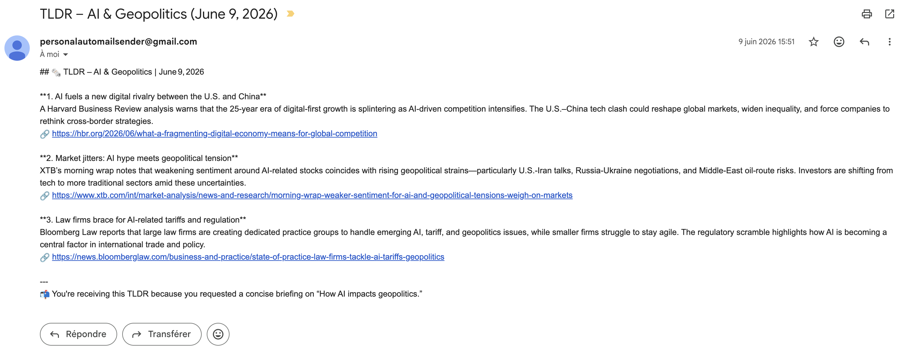

# AI TLDR

A daily AI-generated newsletter on a configurable topic, summarized and delivered straight to your inbox. It runs **once per day at 6 AM** on AWS (EventBridge + Lambda), or locally on demand.

Give it a topic such as `How AI impacts geopolitics`, and two cooperating LLM agents search the web, distill the best articles, write a friendly digest, and email it to you.

## How it works

AI TLDR is built around **two cooperating agents** that talk to the model through a plain tool-calling loop:

- The **orchestrator** owns the workflow. It decides when to search, when the findings are good enough, when to write the TLDR, and when to send the email.
- The **search agent** is delegated to as a single tool (`search_articles`). It runs its own web-search loop and returns a compact, validated JSON handoff.

A key detail of the design: **the model never executes tools itself**. Each agent asks the model what to do next, the model replies with `tool_calls`, and Python runs the actual function and appends the result back into the conversation as a `role: "tool"` message. The same loop powers both agents, in [orchestrator.py](orchestrator.py) and [agents/search_agent.py](agents/search_agent.py).

## Architecture



| Component | File | Role |
|-----------|------|------|
| Entry | [main.py](main.py) | Loads the topic, starts an MLflow run, and calls the orchestrator. |
| Orchestrator | [orchestrator.py](orchestrator.py) | Coordinates the workflow: call the search agent (up to 2 times), write the TLDR, shorten if needed, and send the email. |
| Search agent | [agents/search_agent.py](agents/search_agent.py) | Runs up to 3 `browse_internet` rounds, then builds a validated JSON handoff. |
| Handoff guardrails | [agents/handoff.py](agents/handoff.py) | Truncates tool results and validates/trims the JSON before it returns to the orchestrator. |
| Web search | [tools/browse_internet.py](tools/browse_internet.py) and [tools/scoring.py](tools/scoring.py) | SerpAPI search, then rank articles and extract their body text. |
| Email | [tools/send_email.py](tools/send_email.py) | SMTP delivery (Gmail in development; AWS SES is recommended for production). |
| Tool schemas | [tools/registry.py](tools/registry.py) and [tools/schema.py](tools/schema.py) | Turn plain Python functions into Groq tool definitions. |

## How the search agent works

When the orchestrator decides it needs fresh material, it calls `search_articles(topic, feedback, previous_findings)` as a tool. That single call kicks off the search agent's own loop:

1. **Delegation.** The orchestrator hands off the topic, plus optional feedback and previous compact findings, to the search agent ([agents/search_agent.py](agents/search_agent.py)).

2. **Search loop (up to 3 rounds).** The search agent's model picks a `search_query` and a `tbm` value (news, web, finance, shopping, and so on) and calls `browse_internet`:
   - SerpAPI fetches results ([tools/browse_internet.py](tools/browse_internet.py)).
   - Articles are scored by trusted domain, freshness, and keyword relevance ([tools/scoring.py](tools/scoring.py)).
   - The top articles are fetched and their main text is extracted with trafilatura.
   - Raw tool output is truncated to roughly 3000 characters before it re-enters the context, keeping the conversation small ([agents/handoff.py](agents/handoff.py)).

3. **Handoff build.** After the search rounds, a tool-free model call turns everything gathered into compact JSON:

```json
{
  "articles": [
    {"title": "...", "summary": "2-4 sentences", "url": "https://..."}
  ],
  "coverage_note": "optional"
}
```

4. **Validation.** The handoff is parsed, summaries are trimmed to at most 80 words, the list is capped at 5 articles, and oversized payloads are rejected ([agents/handoff.py](agents/handoff.py)).

5. **Orchestrator retry.** If the findings are weak or incomplete, the orchestrator can call `search_articles` again (at most 2 calls total), passing concise feedback and the previous compact findings so the next search is sharper.

The whole thing is a tool-calling loop in both directions:

```
LLM → tool_call(browse_internet) → Python runs SerpAPI → tool result → LLM → ... → JSON handoff
```

## Example newsletter

Below is an illustrative example of the kind of email AI TLDR produces for the topic `How AI impacts geopolitics`. It follows the formatting rules in the orchestrator prompt: a welcoming intro with emojis, one bullet per article, a title and short summary for each, and a source link.

> Example output



## Quick start (local)

```bash
pip install -r requirements.txt
export IS_DEBUG=True
python main.py
```

Set the topic in [topic.txt](topic.txt) for local runs (the production path is `/home/pi/newsletter/topic.txt`). If no topic file is found, it falls back to a default AI research topic.

## AWS deployment (daily 6 AM)

1. **Lambda.** Package this code (or use a layer for dependencies) and set the handler to `main.lambda_handler`.
2. **EventBridge.** Create a rule with the schedule `cron(0 6 * * ? *)` (6 AM UTC) and target the Lambda.
3. **Secrets.** Provide the environment variables below, preferably via Secrets Manager or SSM rather than plain Lambda config.

## Configuration

All configuration is read from environment variables ([config.py](config.py)):

| Variable | Purpose |
|----------|---------|
| `GROQ_API` | Groq API key (used by both agents). |
| `NEWS_API_KEY` | SerpAPI key for web search. |
| `EMAIL_FROM` | Sender email address. |
| `EMAIL_TO` | Recipient email address. |
| `EMAIL_PASSWORD_SENDER` | SMTP password / app password for the sender account. |
| `IS_DEBUG` | Set to `True` to use the local `topic.txt` path and the debug MLflow experiment. |

## Observability

Each run is traced with MLflow. The pipeline logs the tools available to each agent and metrics such as `search_rounds`, `search_calls`, and `nbr_of_rounds`, so you can inspect how a given digest was produced under `mlruns/`.

## Models

- Orchestrator: `openai/gpt-oss-120b`
- Search agent: `llama-3.3-70b-versatile`

Both run on [Groq](https://groq.com/).

## Project layout

```
main.py                  Entry point and AWS Lambda handler
orchestrator.py          Orchestrator agent: workflow + TLDR + email
config.py                Environment-based configuration
agents/
  search_agent.py        Search agent: web-search loop + JSON handoff
  handoff.py             Handoff validation and context guardrails
tools/
  browse_internet.py     SerpAPI web search
  scoring.py             Article ranking and text extraction
  send_email.py          SMTP email delivery
  registry.py            Tool registries per agent
  schema.py              Python function to Groq tool schema
```
